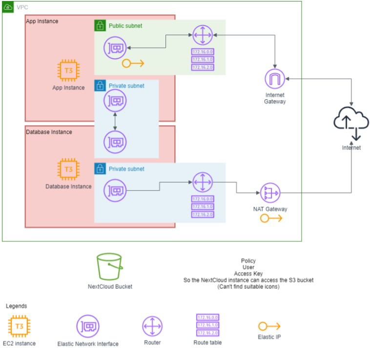

# Introduction

This project is going to deploy cloud storage software called NextCloud on Amazon web services using an infrastructure-as-code software called Terraform.

# Infrastructure

## Terraform resources :

1. aws_vpc
2. aws_subnet
3. aws_network_interface
4. aws_security_group
5. aws_instance
6. aws_internet_gateway
7. aws_nat_gateway
8. aws_route_table
9. aws_route_table_association
10. aws_eip
11. aws_s3_bucket
12. aws_s3_bucket_public_access_block
13. aws_iam_access_key
14. aws_iam_user
15. aws_iam_policy
16. aws_iam_user_policy_attachment
